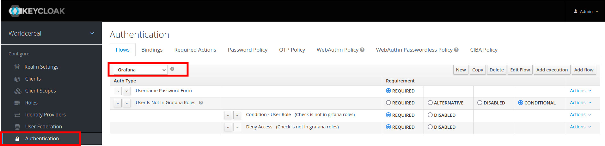
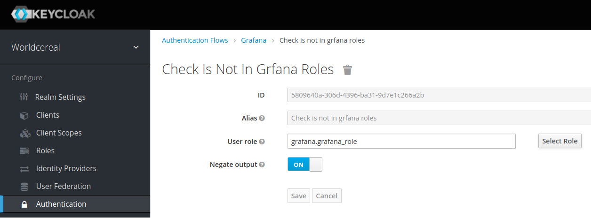
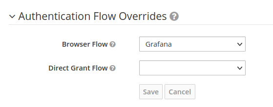
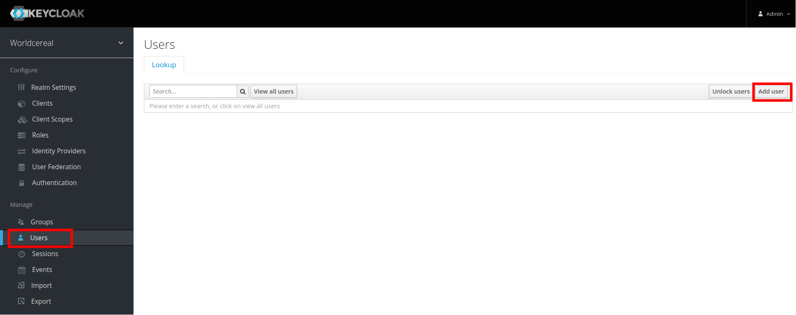
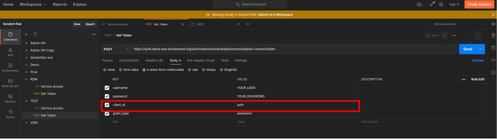
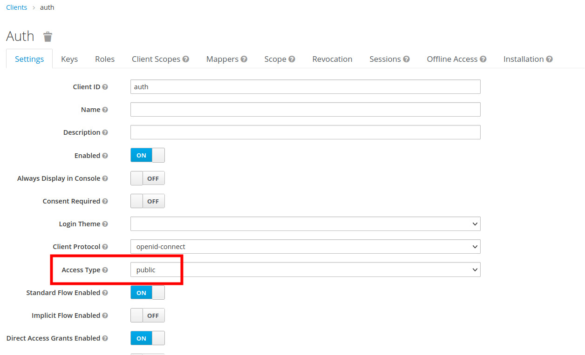
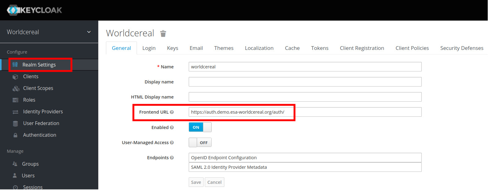

# Keycloak in Worldcereal context
Worldcereal uses Keycloak as SSO for accessing services hosted on the cluster.
This files details what configuration has been applied.

## Header Management
Keycloak handles the HTTP headers for VDM and RDM applications.
It means that Keycloak provides to both applications
informations about the current user through HTTP headers. 
VDM and RDM applications then use thoses data to perform specific treatments on their own.

**This implies that, when a user is created, all thoses informations are correctly set on Keycloak.**

### User configuration
Informations needed are:
- The **group**: The user needs to be member to one of the 3 available groups.
[Here](#group-mapper)

- The **UUID**: The user must have the role_id attribute set with an UUID.[Here](#uuid-mapper)
- The **username**: Which is set and mandatory at the user creation step.

### Client side
The Keycloak client side then needs to be configured to inject thoses data in a specific OIDC header.
For instance, on the VDM client, click on **Mappers** tab then click on **Create** button and create the 3 following models.

#### Group mapper
The group token mapper has the following properties:
```
    Name: group (The token mapper name)
    Mapper Type: Group Membership
    Token Claim Name: group (This field is the attribute name that will be provided in the header)
    Full group path: OFF
    Add to ID token: ON
    Add to access token: ON
    Add to userinfo: ON 
```

#### Username mapper

```
    Name: username
    Mapper Type: User Property
    Property: username
    Token Claim Name: preferred_username (This field is the attribute name that will be provided in the header)
    Claim JSON Type: String
    Add to ID token: ON
    Add to access token: ON
    Add to userinfo: ON
```
#### UUID mapper
This token mappers is plugged to the user attribute set here [here](#user-management) this is done by setting the same name as the one in user attribute (ex: role_id).
```
    Name: attribute mapper
    Mapper Type: User Attribute
    User Attribute: role_id (This name must be the same as the one in user attribute)
    Token Claim Name: attribute
    Claim JSON Type: N/A
    Add to ID token: ON
    Add to access token: ON
    Add to userinfo: ON
    Multivalued: OFF
    Aggregate attribute values: OFF
```
### X-Userinfo header
If all is correctly set, the client application must receives in request an header called
X-Userinfo encoded in base64 that contains all the attribute set in previous steps.

Exemple: Decoded base64 X-UserInfo
```
{"email_verified":true,"preferred_username":"iiasa_user","userid":"XXXXXX-XXXXX-XXXXX-XXXXX-907e5e5f0e58","sub":"XXXXXXX-f5XXXXff-XXXXXX-938d-42679cc1a574","id":"XXXXXXXXX-XXXXXXX-XXXXXXX-938d-42679cc1a574","username":"iiasa_user","group":["ewoc_admin"],"attribute":"XXXXXX-XXXXXX-4775-a732-XXXXXX"}
```
## Group Management

The standard configuration deploy 3 groups at the Keycloak level.
ewoc_user, ewoc_admin,ewoc_plateform.
The only difference between group is the access that can be done to the exposed services.

`ewoc_user` can only access RDM, VDM and WCTiler
`ewoc_admin` access to monitoring logs and metrics (Graylog & Grafana) in addition user role.
`ewoc_plateform` can access all module (prometheus)

This access segmentation is done by managing 3 differents notions in Keycloak.
The `client role`.
The `Keycloak user type role` (user,admin,superadmin).
The `group` (ewoc_user,ewoc_admin,ewoc_plateform).

### Client role
For each client created, we create a role linked to this client.
For instance VDM client has a role `dissemination_role` this is a `client role`.

### User type role
In the role, there is 3 composites roles which are `user,admin,superadmin`.
Each on is composed of N `clients roles`.
For instance the user type role `user` is composed of `dissemination_role` + `rdm_role` + `wctiler_role`.
So basically, the user type role `user` can access RDM,VDM,WCtiller.

When created, thoses roles are configured to be composite, and so there are able to expend with other user type roles, which is why the `superadmin` inherits from `ewoc_admin` which inherits himself from `ewoc_user` applications. 

### Group
3 Groups are created `ewoc_user,ewoc_admin,ewoc_plateform`, for each on of them there is a 1-1 cardinality with each of the user type roles.
Put simply:
- The group `ewoc_user` is associated with the user type role `user`.
- The group`ewoc_admin`  is associated with the user type role `admin`.
- The group`ewoc_plateform` is associated with the user type role `superadmin`.

Finally, each time that a user is created, it is associated with a group which is linked to the applications that it can access.

### Role access segregation
An user is associated to a group which according the level of importance gives the right to access more applications.
Keycloak do not provide such feature which means that once a client is created it can be accessed without check of the user group level, that why is added some authentications workflows to client application.

The picture below shows the steps in the workflow.
It check that the current authenticated user **do not** has the grafana role, and if it the case the access to the grafana application is denied. 



In the sub workflow, there is a conditional steps that performs the check of the role presence. 


Finally in the client configuration we added the newly created authentication method.


## User management
To create a user, click on user sub-menu and then on the button `add user`.



Fill the form by setting the username, set email verified to On and select the right group for your user, click on save.
On the newly created user, select the credential tab and assign a password, set temporary button to off.
Then click on Attributes tab and add on entry with attribute name: `role_id`
and the generated **UUID** for the current user as value. 
Save.


## Keycloak for API applications
Worldcereal uses Keycloak as SSO for accessing services hosted on the cluster. This means that the authentication of users is performed by Keycloak and not by the applications themselves.

### Issue
One issue using Kong and Keycloak is that when exposing an application this route can only supports one  authentication method.

For instance, VDM application is a standard browser application whit GUI, and it uses API to
expose data in the front end. 
We created on standard ingress with kong plugin in order to handle authentication, it means that when a user wants to connect to the VDM application through internet, if the user is not connected the requests are redirect to Keycloak form authentication that allows the user to authenticate himself.   


Now let's imagine that we want to expose the API from this application.
When unauthenticated, the behaviour of Keycloak is going to be the same, the API call is going to be redirect to the Keycloak authentication form which is not REST.

### Solution

2 Ingress can not uses the same URL, this means that the "standard application" and the API can not share the same URL.
That's why VDM application and RDM application have 2 clients entries on Keycloak that dont have the same URL.VDM,VDMAPI and RDM,RDMAPI.
For instance, 
VDM points to https://vdm.DOMAIN.org/* and VDMAPI to https://vdmapi.DOMAIN.org/*

#### Case standard browser application
On the Keycloak client part VDM for instance, the client configuration are the same,
we have a clientid which is the application name vdm, a client secret has been generated using the credential tab, the access_type is confidentential and is provided the url that this service is going to user as valid redirect.

On the kong ingress
```
    apiVersion: configuration.konghq.com/v1
    config:
    bearer_only: "no"
    client_id: vdm
    client_secret: YOUR_CLIENT_SECRET
    discovery: https://auth.demo.DOMAIN/auth/realms/worldcereal/.well-known/openid-configuration
    introspection_endpoint: https://auth.demo.DOMAIN/auth/realms/worldcereal/protocol/openid-connect/token/introspect
    logout_path: /logout
    realm: worldcereal
    redirect_after_logout_uri: /
    redirect_uri_path: null
    response_type: code
    scope: openid
    session_secret: null
    ssl_verify: "no"
    token_endpoint_auth_method: client_secret_post
    kind: KongPlugin
    metadata:
    name: vdm-oidc
    namespace: vdm
    plugin: oidc
```

#### Case Api application "Bearer token"
The authentication by API is performed with two steps for users.
- First, Send a POST request to Keycloak with a public client created in the next step, + the users credentials. If the data are correct, Keycloak is going to provide an access token.
- Access the API URL directly and use the provided Access token as Authenticatio Bearer token. 



- On Keycloak, create a specific client called "auth" for instance with the following properties.


**This client must be public, it's only purpose is to allows user to authenticates themself in order to get an access token**

**NB: This client is created only once and will be used for all the API that you want to expose**


- On Kubernetes, the only difference is the bearer only in the ingress declaration.

```
apiVersion: configuration.konghq.com/v1
config:
  bearer_only: "yes"
  client_id: vdmapi
  client_secret: YOUR_CLIENT_SECRET
  discovery: http://auth.demo.DOMAIN/auth/realms/worldcereal/.well-known/openid-configuration
  introspection_endpoint: http://auth.demo.DOMAIN/auth/realms/worldcereal/protocol/openid-connect/token/introspect
  logout_path: /logout
  realm: worldcereal
  redirect_after_logout_uri: /
  redirect_uri_path: null
  response_type: code
  scope: openid
  session_secret: null
  ssl_verify: "no"
  token_endpoint_auth_method: client_secret_post
kind: KongPlugin
metadata:
  name: vdmapi-oidc
  namespace: vdm
plugin: oidc
```

**The api_authentication.md file explain how to use postman to test the authentication through API**


## Keycloak HTTPS
When creating Keycloak instance on kubernetes, the configuration set to use HTTP which is ot recommanded.
To use HTTPS connect to the administration page of Keycloak in HTTP, change the current realm to master. Update the frontend URL by updating http to https https://auth.YOUR_HOSTNAME/auth/.




