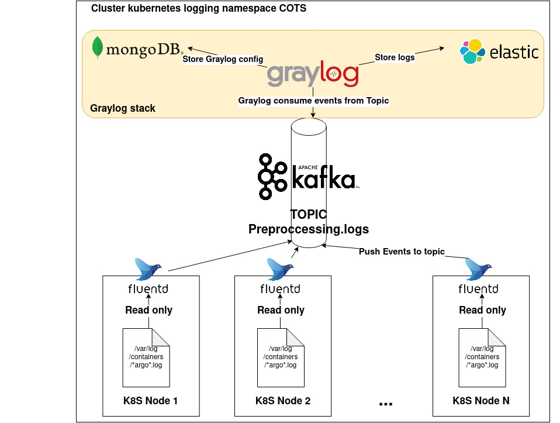

# Deploy log stack WorldCereal


## Purpose :

Deploy and configure the stack that handle the logging system of the worldcereal plateform.
All this items are located in the **logging** namespace.
The logging system repose on following product to store logs. 

- First, fluent-bit pods are placed on each node and send the logs to a kafka topic.
- The kafka topics keeps the events until a consumer come to read them.
- Graylog is the consumer and use kafka to retrieve events and store them in his elasticsearch DB.




## Steps :
- Init
- Install Kafka
- Install Fluent-bit
- Install Graylog stack

### Init 
- First Create namespace for the logging stack using : 
```kubectl create namespace logging```

- Create the secret `harborcs` that allow to pull the image from private registry.
```kubectl create secret -n vdm docker-registry harborcs --docker-server=YOUR_REGISTRY --docker-username=REGISTRY_USERNAME --docker-password="REGISTRY_PASSWORD"```

### Install Kafka

#### Info
KAFKA_CHART_VERSION="14.1.0"
KAFKA_VERSION="2.8.0-debian-10-r84"
https://bitnami.com/stack/kafka/helm

#### Steps

Go to *chart/logging/kafka* and execute the following commands:
`make build && make deploy`
The deploy step will use the *init-deployment.yaml* in *chart/logging/init* that creates the namespace **logging** and the the sercret **harborcs** allocated for this namespace.

Once kafka is deployed and running you can create the topics by using :
`make create_topic`

The following topic should be created.
- **preprocessing.logs** 
- **keycloak.logs**
- **system.logs**

For now, the topic retention is only set to one day.

If you wish to add topic you can modify the Makefile and add your topic by using the following command as exemple :

`kubectl exec -n logging kafka-0 -c kafka -- kafka-topics.sh --bootstrap-server kafka.logging.svc.cluster.local:9092 --create --topic preprocessing.logs --partitions=3 --replication-factor=3 --config cleanup.policy=delete --config retention.ms=604800000 --config retention.bytes="-1"`

To delete the install ( PVC not included) use `make delete`.

### Install Fluent-bit
#### Info
FLUENTBIT_CHART_VERSION="0.16.6"
FLUENTBIT_VERSION="1.8"
https://github.com/fluent/helm-charts/tree/main/charts/fluent-bit

#### Steps
Go to *chart/logging/fluentbit* and execute the following commands :
`make build && make deploy`
This will deploy as deamonset on each node, one instance of fluent-bit wich is supposed to transmit all the logs collected to the topic configured in Kafka.

If you wish to add logs in the workflow, you should delete the daemonset by using `make delete` and then edit the config section in the values.yaml file. Once done you can redeploy the daemonset.

**Be carefull the rules syntax is tricky, respect the current format in order to avoid issues**
To delete the install use `make delete`.

### Install Graylog stack
The graylog stack depends on 3 elements to works properly.
- The Graylog application
- MongoDB to store Graylog configuration
- Elasticsearch to store events logs.

### Install ElasticSearch
#### Info
ELASTIC_CHART_VERSION="17.0.3"
ELASTIC_VERSION="7.14.1-debian-10-r8"
https://bitnami.com/stack/elasticsearch/helm

#### Steps
Go to *chart/logging/graylog-stack/ElasticSearch* and execute the following commands :
`make build && make deploy`

To delete (PVC not included) use `make delete`.


### Install MongoDB
Deploy Elasticsearch (node affinity !!) (heap 8go)

#### Info
MONGO_CHART_VERSION="10.26.1"
MONGO_VERSION="4.4.9-debian-10-r0"
https://bitnami.com/stack/mongodb/helm

#### Steps
Go to *chart/logging/graylog-stack/Mongodb* and execute the following commands :
`make build && make deploy`
This chart create one user graylog with a password present in the chart for the graylog database. If you change the password, think to change in on the graylog Makefile.

The password for graylog user is generated randomly and stored as secret.

To delete (PVC not included) use `make delete`.

### Install Graylog
#### Info
GRAYLOG_CHART_VERSION="1.8.5"
GRAYLOG_VERSION="4.1.3-1"
https://github.com/KongZ/charts

#### Steps
Go to *chart/logging/graylog-stack/Graylog* and execute the following commands :
`make build && make deploy`

Once the application is online, we have to create the input object that is used by 
graylog to retrieve events from Kafka. 
To do so, execute the following command: 
`make config` then `make install_pack`

Then connect to Graylog then check that the input kafka is present and running.

The password is random generated and to get it you have to use the following commands.
`$(kubectl get secret --namespace logging graylog -o "jsonpath={.data['graylog-password-secret']}" | base64 --decode)`
It allow you yo access the graylog web app.

To delete (PVC not included) use `make delete`.


